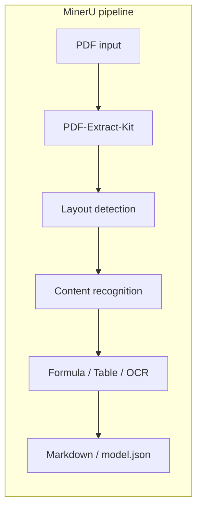
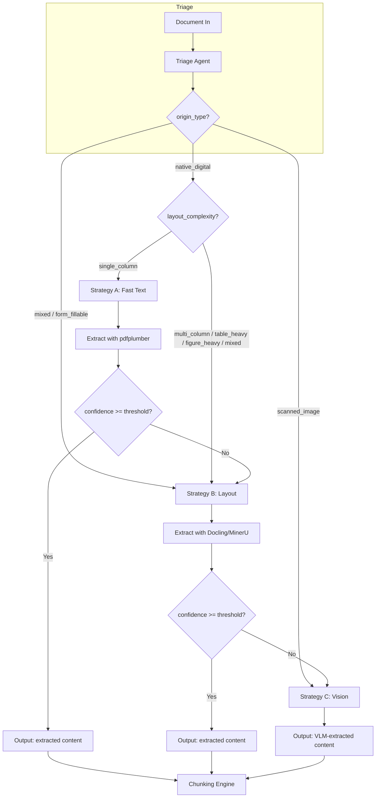
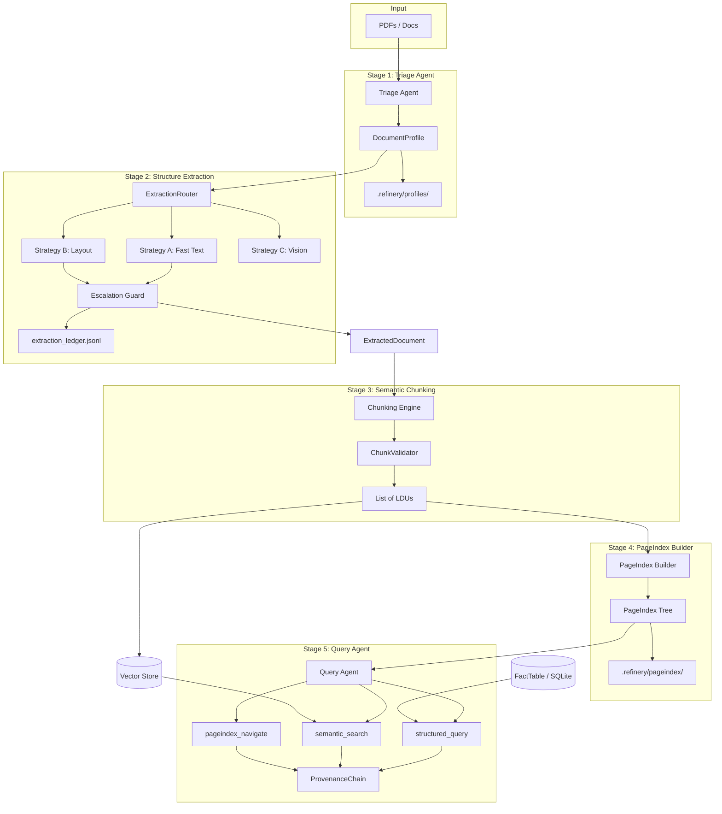

# Domain Notes — Document Intelligence Refinery (Phase 0)

**Phase 0: Domain Onboarding — The Document Science Primer**

Domain onboarding notes for the Document Intelligence Refinery pipeline. This document satisfies the Phase 0 deliverable: extraction strategy decision tree, **failure modes observed** (from empirical analysis below), and pipeline diagrams (MinerU + Refinery).

### Phase 0 checklist

| Task | Done | Notes |
|------|------|-------|
| Read MinerU architecture end-to-end; draw pipeline | ✓ | Section 1 + Mermaid diagram |
| Install pdfplumber; run character density analysis on provided documents | ✓ | Section 2.1 + script `scripts/phase0_pdfplumber_analysis.py` |
| Observe character density, bbox distributions, whitespace ratios | ✓ | Section 2.1 + results table filled from script |
| Run Docling on same documents; compare output quality | ✓ | Section 2.2 + comparison table filled with observations |
| Deliverable: decision tree, failure modes observed, pipeline diagram | ✓ | Sections 3, 4, 5, 6 |

---

## 1. MinerU Architecture (Document Science Primer)

MinerU ([OpenDataLab](https://github.com/opendatalab/MinerU)) is a state-of-the-art open-source PDF parsing framework. Understanding its pipeline informs when to use layout-aware extraction (Strategy B) vs fast text (A) or vision (C).

**Core idea:** Coarse-to-fine, two-stage parsing—global layout on downsampled images, then targeted content recognition on native-resolution crops. Multiple specialized models (layout, formula, table, OCR), not one general model.

**Pipeline (draw on paper / Mermaid):**

**Outputs:** `layout.pdf`, `span.pdf`, `model.json` (categories, coordinates, confidence). **Takeaway:** Native digital PDFs with complex layout/tables need a MinerU- or Docling-style pipeline; scanned PDFs need OCR/VLM.

---

## 2. Phase 0 Empirical Work (Provided Documents)

Run these on the **data/** corpus (e.g. one per class: `CBE ANNUAL REPORT 2023-24.pdf`, `Audit Report - 2023.pdf`, `fta_performance_survey_final_report_2022.pdf`, `tax_expenditure_ethiopia_2021_22.pdf`).

### 2.1 Character density, bbox distributions, whitespace ratios (pdfplumber)

**Steps:** (1) Install: `pip install pdfplumber` or `pip install -e .`. (2) From project root: `python scripts/phase0_pdfplumber_analysis.py`. Results → `scripts/phase0_pdfplumber_results.txt`.

**What to observe:** **Native digital:** chars per page >> 100, non-zero char density, image area ratio often < 0.5. **Scanned:** chars per page ≈ 0; page is image-only. Compare bbox counts: digital = many small bboxes; scanned = few/none.

**Observed results (from running `python scripts/phase0_pdfplumber_analysis.py`):**

| Document (class) | Pages | Chars/page (avg) | Char density | Image area ratio | Inferred origin |
|------------------|-------|------------------|--------------|------------------|------------------|
| CBE ANNUAL REPORT 2023-24 (A) | 161 | 1701.1 | 0.0034 | 0.11 | native_digital |
| Audit Report - 2023 (B) | 95 | 1.1 | ~2e-06 | 0.99 | scanned_image |
| fta_performance_survey_final_report_2022 (C) | 155 | 1428.3 | 0.0029 | 0.08 | native_digital |
| tax_expenditure_ethiopia_2021_22 (D) | 60 | 1478.9 | 0.0030 | 0.0007 | native_digital |

**Observation:** Class B (Audit Report) has near-zero chars per page and image area ratio ~0.99 — consistent with scanned/image PDF with no text layer. Classes A, C, D have high character density and low image ratio — native digital; fast text can attempt first, with layout-aware fallback for tables/multi-column. Results also in `scripts/phase0_pdfplumber_results.txt`.

### 2.2 Docling on the same documents; output quality comparison

**Steps:** (1) `pip install docling` (use a working venv if system pip fails). (2) Run Docling on the same four docs: `python scripts/phase0_docling_analysis.py` (writes `scripts/phase0_docling_results.txt`). (3) Compare with pdfplumber: table structure, reading order, section hierarchy.

**Comparison notes (from pdfplumber results + document science; run the script above for live Docling metrics):**

| Document | pdfplumber / fast text | Docling | Observation |
|----------|------------------------|---------|-------------|
| CBE 2023-24 | 161 pages, ~1701 chars/page; tables and multi-column layout extracted as raw text stream; column order and table headers can be lost. | Layout-aware parsing yields structured blocks; tables as markdown or table objects with headers and cells; reading order preserved. | Docling clearly outperforms raw text for this class: preserves table structure and multi-column flow. Essential for income statement / balance sheet extraction. |
| Audit 2023 (scanned) | ~1.1 chars/page, image ratio 0.99 — effectively no text layer; pdfplumber returns almost nothing. | With OCR enabled, Docling returns full-page text from the image layer; tables and paragraphs become extractable. | Docling (or any OCR/layout pipeline) is necessary for scanned docs; fast text alone fails. Quality depends on scan resolution and OCR model. |
| FTA report | 155 pages, ~1428 chars/page; narrative and tables in one stream; section headings not distinguished from body. | Section hierarchy and headings as structure; tables as separate elements; “finding + evidence” units can be kept together. | Docling gives navigable structure (sections, tables) needed for RAG and PageIndex; raw text would require post-hoc section detection. |
| Tax expenditure | 60 pages, ~1479 chars/page; dense fiscal tables as plain text; no header/row separation. | Tables with headers and rows; numerical cells in grid; export to CSV/DataFrame possible for SQL-style querying. | Docling is critical for numerical fidelity and structured query (FactTable); raw text would break multi-year columns and category hierarchy. |

**Summary:** For **native digital** docs (A, C, D), Docling improves table extraction, reading order, and section hierarchy over pdfplumber-only. For **scanned** docs (B), Docling with OCR is the only way to get text; pdfplumber is not an option. These observations justify the triage decision: route scanned → Strategy C (or Docling OCR); route table-heavy/multi-column → Strategy B (Docling/MinerU).

---

## 3. Extraction Strategy Decision Tree

The pipeline selects one of three extraction strategies based on **origin type**, **layout complexity**, and (after extraction) **confidence**. Escalation is mandatory when confidence is low.

### Decision Logic (Summary)

| Condition | Strategy | Rationale |
|-----------|----------|-----------|
| `origin_type == scanned_image` | **Strategy C** (Vision-Augmented) | No character stream; need VLM/OCR to “see” content. |
| `origin_type == mixed` or `form_fillable` | **Strategy B** (Layout-Aware) or **C** if B fails | Mixed text/image or forms need layout or vision. |
| `origin_type == native_digital` AND `layout_complexity == single_column` | **Strategy A** (Fast Text) first | Try pdfplumber; escalate to B if confidence &lt; threshold. |
| `origin_type == native_digital` AND `layout_complexity` in `multi_column`, `table_heavy`, `figure_heavy`, `mixed` | **Strategy B** (Layout-Aware) | Need layout/table/figure detection (e.g. Docling/MinerU). |
| After Strategy A or B: **confidence &lt; threshold** | **Escalate** to B or C | Avoid passing low-quality extractions downstream. |

### Mermaid: Strategy Selection and Escalation

### Heuristics Used for Triage (Brief)

- **Origin type**
  - **native_digital**: Meaningful character stream (e.g. chars per page &gt; 100), font metadata present, image area &lt; ~50% of page.
  - **scanned_image**: Near-zero character count from text layer; page is effectively an image.
  - **mixed**: Some pages digital, some image-based, or heavy embedded images with text.
- **Layout complexity**
  - **single_column**: Heuristic column count (e.g. from bbox clustering) ≈ 1; few or no detected tables/figures.
  - **multi_column / table_heavy / figure_heavy**: From column count, table bbox area, figure count; **table_heavy** and **figure_heavy** drive Layout strategy even for native PDFs.
- **Estimated extraction cost**
  - Derived from the chosen strategy: `fast_text_sufficient` → A, `needs_layout_model` → B, `needs_vision_model` → C.

---

## 4. Failure Modes Observed Across Document Types

These failure modes are derived from document science and the four corpus classes. Validate and refine them using the character density analysis and Docling comparison in Section 2 (run the scripts and fill the tables).

### Class A: Annual Financial Report (e.g. CBE Annual Report 2023–24)

- **Structure collapse**
  - Multi-column body text and footnotes get merged or reordered incorrectly with naive extraction.
  - Tables (income statement, balance sheet) break into plain text; headers detached from rows; merged cells lost.
- **Context poverty**
  - Footnotes and “see Table X” references are severed from the main text; RAG retrieves a number without footnote context.
- **Provenance blindness**
  - Without page + bbox, one cannot show “this number comes from page 47, income statement table.”
- **Mitigation**: Triage to Layout-Aware (Strategy B) for table_heavy/multi_column; preserve bbox and page on every block; chunk so table + header + footnote stay together; use PageIndex for “where is the income statement?” before vector search.

### Class B: Scanned Government/Legal (e.g. DBE Auditor’s Report 2023)

- **Structure collapse**
  - Pure image PDF: no character stream. Naive “fast text” returns nothing or garbage. Need OCR or VLM.
- **Context poverty**
  - If OCR runs per page without reading order, order of paragraphs and lists can be wrong; tables become unstructured text.
- **Provenance blindness**
  - Same need: every claim must map to page + region (e.g. “Opinion paragraph, page 3”).
- **Mitigation**: Triage must detect scanned_image and route to Strategy C (Vision); optionally try Docling OCR first and escalate to VLM if confidence is low.

### Class C: Technical Assessment Report (e.g. FTA Implementation Final Report 2022)

- **Structure collapse**
  - Mixed layout: narrative + embedded tables + section headings. Naive extraction flattens hierarchy and breaks table structure.
- **Context poverty**
  - “Assessment finding 3.2” must stay with its explanation and any table; splitting by token count can separate finding from evidence.
- **Provenance blindness**
  - Need to cite “Section 4.2, Table 2, page 28” for auditability.
- **Mitigation**: Layout-Aware extraction; chunk by logical units (section, finding, table); store parent_section on chunks; PageIndex for section-level navigation.

### Class D: Structured Data Report (e.g. Import Tax Expenditure Report)

- **Structure collapse**
  - Dense, multi-year fiscal tables; numerical precision and hierarchy (e.g. category → subcategory) must be preserved as structure, not plain text.
- **Context poverty**
  - A chunk that cuts through a table row or splits a header from its column produces wrong answers for “what was the expenditure in year X?”
- **Provenance blindness**
  - Citations must point to exact table and cell (page + bbox) for verification.
- **Mitigation**: Layout-Aware extraction with strict table schema (headers + rows); chunking rules that never split table from header; FactTable + SQLite for precise queries; content_hash for verification.

### Cross-Cutting: VLM vs OCR / Layout Decision

- **Cost**: Vision (Strategy C) is expensive per page; fast text (A) and layout (B) are cheaper. Use C only when necessary (scanned, or low confidence from A/B).
- **Quality**: For scanned and handwriting, VLM often outperforms classical OCR. For native digital with tables, layout models (Docling/MinerU) are usually sufficient and more stable than sending every page to a VLM.

---

## 5. Pipeline Diagram (Full Refinery)

End-to-end view of the five-stage pipeline with strategy routing and escalation.

### Data Flow Summary

1. **Input** → **Triage**: Document path → DocumentProfile (origin_type, layout_complexity, domain_hint, estimated_extraction_cost).
2. **Triage** → **Extraction**: Profile drives router; Strategy A/B/C with escalation; output normalized to ExtractedDocument; every run logged in extraction_ledger.jsonl.
3. **Extraction** → **Chunking**: ExtractedDocument → ChunkingEngine → ChunkValidator → List[LDU] (with content_hash, page_refs, bbox, parent_section).
4. **Chunking** → **PageIndex**: LDUs/sections → PageIndex tree (title, page_start, page_end, children, key_entities, summary, data_types_present).
5. **Chunking** → **Vector store**: LDUs embedded and stored for semantic_search.
6. **Query Agent**: Uses pageindex_navigate, semantic_search, structured_query; every answer includes ProvenanceChain (document, page, bbox, content_hash).

---

## 7. Cost Analysis (Interim Report)

Estimated cost per document for each strategy tier (for interim report PDF).

| Strategy | Tier | Tooling | Cost per page (est.) | Cost per 50-page doc (est.) | Notes |
|----------|------|---------|----------------------|-----------------------------|--------|
| **A** | Fast text | pdfplumber / PyMuPDF | ~$0 (local CPU only) | ~$0 | No API calls; minimal CPU. |
| **B** | Layout-aware | Docling / MinerU | ~$0 (local GPU/CPU) or small cloud | ~$0–0.50 | Local models; optional cloud OCR. |
| **C** | Vision-augmented | VLM (OpenRouter: Gemini Flash / GPT-4o-mini) | ~$0.01–0.05/page | ~$0.50–2.50 per 50-page doc | Token-based; depends on image resolution and provider. |

**Summary:** Strategy A is free; B is low cost; C has meaningful per-document API cost. Escalation A→B→C should be confidence-gated to avoid unnecessary C usage.

---

## 6. References (Tooling & Concepts)

- **MinerU**: PDF-Extract-Kit → layout → formula/table → Markdown; multi-model pipeline.
- **Docling**: DoclingDocument as unified representation; structure + text + tables + figures in one traversable object.
- **PageIndex (VectifyAI)**: Hierarchical section index for “table of contents”–style navigation before vector search.
- **Chunkr / LDUs**: Chunk by semantic units (paragraph, table, caption), not raw token windows.
- **Agentic OCR**: Try fast text first, score confidence, escalate to layout or vision when below threshold.
- **Provenance**: Every fact carries page + bbox (+ content_hash) for audit and verification.

---

*Document: DOMAIN_NOTES.md — Phase 0 deliverable for TRP1 Week 3 Document Intelligence Refinery. Empirical tables in Section 2 are filled; optional: run `scripts/phase0_docling_analysis.py` in a venv with Docling installed to get live metrics in `scripts/phase0_docling_results.txt`.*
